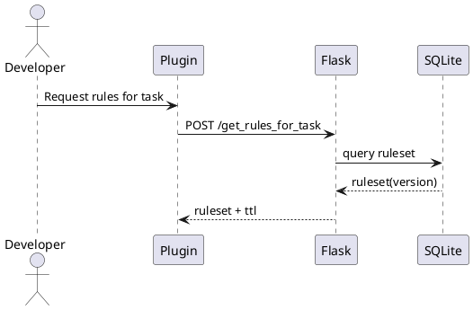
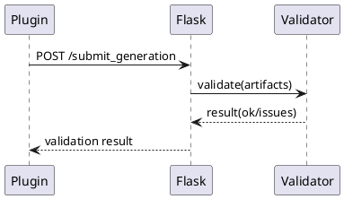
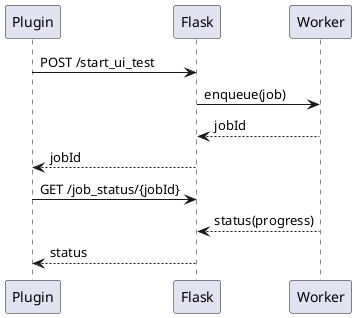
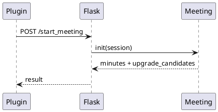

### 验收清单
- [ ] 覆盖规则获取、生成上报、校验、UI测试、会议引擎
- [ ] 每个图包含失败分支与重试

### 目的
以序列图说明典型交互步骤与失败分支。

### 规则获取

```plantuml
@startuml
actor Developer as Dev
participant Plugin
participant Flask
participant SQLite

Dev -> Plugin: Request rules for task
Plugin -> Flask: POST /get_rules_for_task
Flask -> SQLite: query ruleset
SQLite --> Flask: ruleset(version)
Flask --> Plugin: ruleset + ttl
@enduml
```

### 生成上报与校验

```plantuml
@startuml
participant Plugin
participant Flask
participant Validator as V

Plugin -> Flask: POST /submit_generation
Flask -> V: validate(artifacts)
V --> Flask: result(ok/issues)
Flask --> Plugin: validation result
@enduml
```

### UI 测试

```plantuml
@startuml
participant Plugin
participant Flask
participant Worker

Plugin -> Flask: POST /start_ui_test
Flask -> Worker: enqueue(job)
Worker --> Flask: jobId
Flask --> Plugin: jobId
Plugin -> Flask: GET /job_status/{jobId}
Worker --> Flask: status(progress)
Flask --> Plugin: status
@enduml
```

### 会议引擎

```plantuml
@startuml
participant Plugin
participant Flask
participant Meeting

Plugin -> Flask: POST /start_meeting
Flask -> Meeting: init(session)
Meeting --> Flask: minutes + upgrade_candidates
Flask --> Plugin: result
@enduml
```
