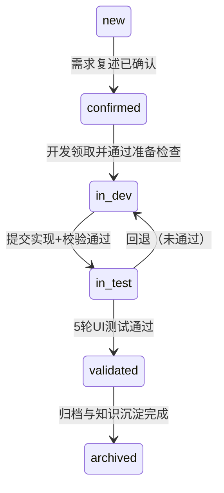

### 验收清单
- [ ] 明确状态机（new→confirmed→in_dev→in_test→validated→archived）
- [ ] 定义触发条件与阻断条件
- [ ] 列出审计字段与自动化检查点

### 状态机

### 触发与阻断
- 进入 in_dev 前：完成阅读铁律清单与代码索引。
- 进入 in_test 前：`/validate_output` 必须返回 ok。
- 进入 validated 前：UI 测试全部通过且视觉差异在阈值内。

### 审计与记录
- 记录人/时间/提交哈希/规则版本/UI测试job_id。
- 关键字段：`task_id`、`state`、`changed_by`、`change_reason`、`artifacts_ref`。

### 相关文件
- `process/task_schema.sql` 定义表结构与索引。
