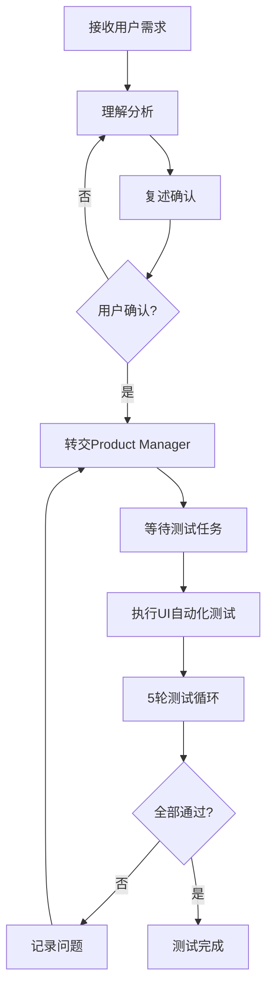
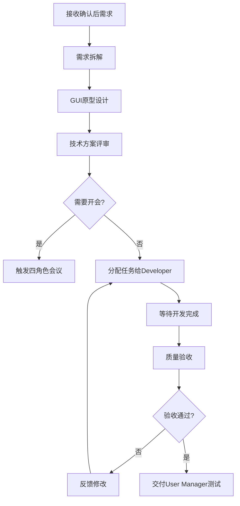
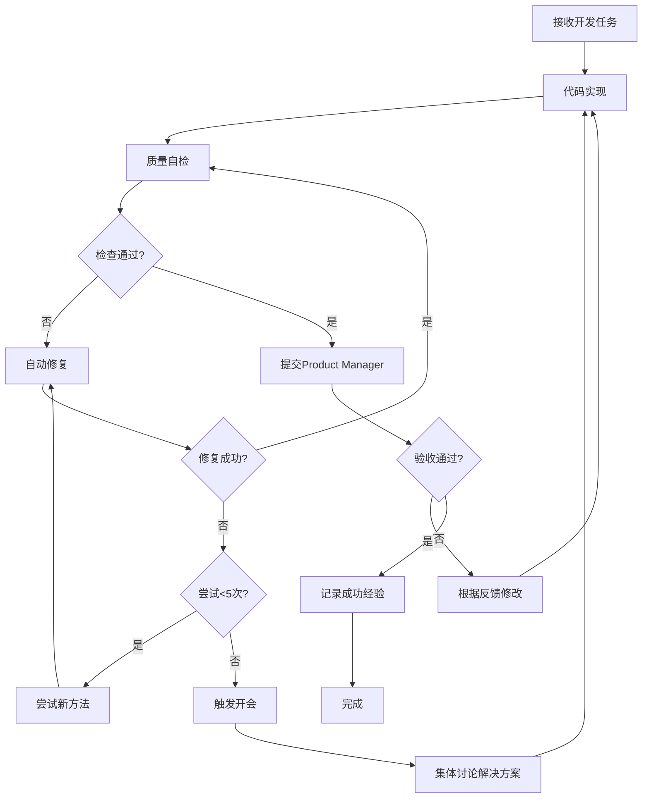
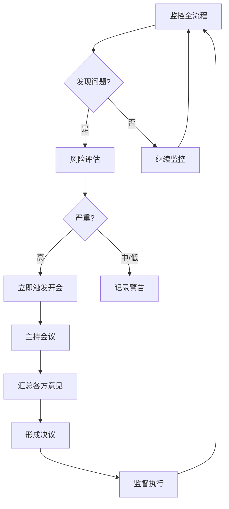
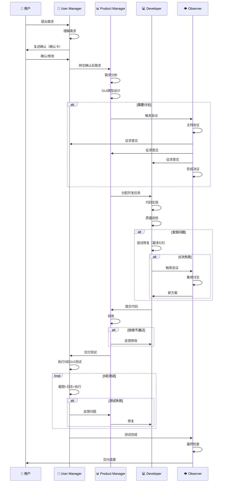

# 四角色系统集成方案 v1.0

**制定时间：** 2025-10-07  
**目标：** 将四角色AI团队系统集成到现有v6.0规则引擎  
**执行率目标：** 90%+

---

## 📋 需求确认总结

### 用户核心需求解读

#### 1. 测试要求（最高优先级）
- ✅ **5轮无错误测试**：每个功能必须通过5次完整测试，无任何错误才算完成
- ✅ **实时监控**：使用实时监控工具跟踪测试过程
- ✅ **截图验证**：每次操作自动截图作为证据
- ✅ **日志记录**：所有操作记录到日志文件
- ✅ **GUI模拟**：模拟用户在桌面应用上的真实操作

#### 2. GUI开发方案
- ✅ **优先级**：原型图 > 实际代码 > 伪代码
- ✅ **技术选型**：基于AI当前最佳能力（Figma/Excalidraw描述 + HTML/CSS代码）

#### 3. 铁律调整
- ❌ **删除铁律3**："AI自主解决原则"（强制执行的规则已删除）
- ⚠️ **铁律4修正**："互联网搜索辅助" - 需要明确触发条件
- ✅ **铁律5**："工具自动修复" - 保留并增强
- ✅ **新增铁律**："无限循环防护" - 必须2选1（无限循环 OR 退出时间）

#### 4. 四角色系统确认
- ✅ **角色切换**：根据场景需求自动决策
- ✅ **开会机制**：轮流发言，不是同时发言
- ✅ **UI自动化**：集成所有有用工具（Playwright/Selenium/PyAutoGUI等）

---

## 🎯 四角色系统架构设计

### 角色定义与职责

#### 1. User Manager (用户经理) - AI1
**核心职责：**
- ✅ 接收用户原始需求
- ✅ 理解需求意图
- ✅ 执行复述确认机制（强制）
- ✅ UI自动化测试执行（模拟真人操作）
- ✅ 5轮测试验证（截图+日志+实际执行）

**技术能力：**
- Playwright/Selenium（Web应用测试）
- PyAutoGUI/Sikuli（桌面应用测试）
- 截图工具（ImageMagick/Pillow）
- 日志记录（Winston/Log4js）

**工作流程：**


---

#### 2. Product Manager (产品经理) - AI2
**核心职责：**
- ✅ 需求分析与拆解
- ✅ GUI原型设计（优先）
- ✅ 技术方案制定
- ✅ 任务分配给Developer
- ✅ 质量验收

**技术能力：**
- GUI设计工具（Figma API/Excalidraw/HTML Prototyping）
- 需求建模
- 用户故事编写
- 原型图生成

**工作流程：**


---

#### 3. Developer (开发者) - AI3
**核心职责：**
- ✅ 接收任务并执行开发
- ✅ 代码质量自检
- ✅ BUG修复（最多5次，失败则换方法）
- ✅ 自动记录成功经验到技能库
- ✅ 工具修复（乱码/无法退出/实时监控等）

**技术能力：**
- 全栈开发
- 代码质量检测（ESLint/Pylint）
- 自动修复工具
- 技能库管理

**工作流程：**


---

#### 4. Observer (观察者) - AI4
**核心职责：**
- ✅ 全流程监控
- ✅ 质量把关
- ✅ 风险预警
- ✅ 会议主持（当触发开会时）
- ✅ 最终交付检查

**技术能力：**
- 日志分析
- 性能监控
- 风险检测
- 报告生成

**工作流程：**


---

## 🔧 技术实现方案

### 1. GUI自动化测试系统（核心）

#### 1.1 技术选型
```yaml
Web应用测试:
  - 主工具: Playwright (首选)
  - 备选: Selenium WebDriver
  - 优势: 跨浏览器、自动等待、内置截图

桌面应用测试:
  - Windows: PyAutoGUI + Win32 API
  - Mac: PyAutoGUI + AppleScript
  - Linux: PyAutoGUI + xdotool
  - 优势: 跨平台、支持坐标/图像识别

截图工具:
  - Playwright自带: screenshot()
  - 系统截图: PyAutoGUI.screenshot()
  - 区域截图: ImageGrab (Pillow)

日志系统:
  - 实时日志: Winston (Node.js)
  - 结构化日志: JSON Lines格式
  - 日志分析: ElasticSearch (可选)
```

#### 1.2 实现架构
```javascript
// scripts/core/gui-test-runner.cjs
const { chromium } = require('playwright');
const pyautogui = require('node-pyautogui');
const logger = require('./logger.cjs');

class GUITestRunner {
  constructor() {
    this.testRounds = 5;
    this.screenshots = [];
    this.logs = [];
  }

  /**
   * 执行5轮GUI测试
   */
  async run5RoundsTest(testConfig) {
    const results = [];
    
    for (let round = 1; round <= this.testRounds; round++) {
      logger.info(`[测试轮次 ${round}/${this.testRounds}] 开始`);
      
      const result = await this.runSingleTest(testConfig, round);
      results.push(result);
      
      if (!result.pass) {
        logger.error(`[测试轮次 ${round}] 失败，终止测试`);
        return { pass: false, failedAt: round, results };
      }
      
      logger.info(`[测试轮次 ${round}] 通过 ✅`);
      
      // 轮次间延迟
      await this.delay(2000);
    }
    
    return { pass: true, allRounds: 5, results };
  }

  /**
   * 单轮测试执行
   */
  async runSingleTest(testConfig, round) {
    const startTime = Date.now();
    const testLog = {
      round,
      startTime: new Date().toISOString(),
      steps: []
    };

    try {
      if (testConfig.type === 'web') {
        return await this.runWebTest(testConfig, round, testLog);
      } else if (testConfig.type === 'desktop') {
        return await this.runDesktopTest(testConfig, round, testLog);
      }
    } catch (error) {
      logger.error(`[轮次${round}] 测试异常:`, error);
      testLog.error = error.message;
      return { pass: false, log: testLog };
    } finally {
      testLog.duration = Date.now() - startTime;
      this.logs.push(testLog);
    }
  }

  /**
   * Web应用测试
   */
  async runWebTest(config, round, log) {
    const browser = await chromium.launch({ headless: config.headless || false });
    const page = await browser.newPage();

    try {
      // 步骤1: 导航
      log.steps.push({ action: 'navigate', url: config.url });
      await page.goto(config.url);
      await this.takeScreenshot(page, `round${round}_step1_navigate`);

      // 步骤2-N: 执行测试步骤
      for (const [index, step] of config.steps.entries()) {
        const stepNum = index + 2;
        log.steps.push({ action: step.action, target: step.target });

        if (step.action === 'click') {
          await page.click(step.target);
        } else if (step.action === 'fill') {
          await page.fill(step.target, step.value);
        } else if (step.action === 'assert') {
          const element = await page.$(step.target);
          if (!element) {
            throw new Error(`断言失败: 元素 ${step.target} 不存在`);
          }
        }

        await this.takeScreenshot(page, `round${round}_step${stepNum}_${step.action}`);
        await this.delay(500); // 操作间延迟
      }

      // 验证最终状态
      if (config.assertion) {
        const result = await page.evaluate(config.assertion);
        if (!result) {
          throw new Error('最终断言失败');
        }
      }

      return { pass: true, log };

    } finally {
      await browser.close();
    }
  }

  /**
   * 桌面应用测试
   */
  async runDesktopTest(config, round, log) {
    // 使用PyAutoGUI模拟桌面操作
    for (const [index, step] of config.steps.entries()) {
      log.steps.push({ action: step.action, target: step.target });

      if (step.action === 'click') {
        await pyautogui.click(step.x, step.y);
      } else if (step.action === 'type') {
        await pyautogui.typewrite(step.text);
      } else if (step.action === 'screenshot') {
        await pyautogui.screenshot(`round${round}_step${index + 1}.png`);
        this.screenshots.push(`round${round}_step${index + 1}.png`);
      }

      await this.delay(1000);
    }

    return { pass: true, log };
  }

  /**
   * 截图并保存
   */
  async takeScreenshot(page, name) {
    const filepath = `screenshots/${name}.png`;
    await page.screenshot({ path: filepath, fullPage: true });
    this.screenshots.push(filepath);
    logger.info(`📸 截图保存: ${filepath}`);
  }

  delay(ms) {
    return new Promise(resolve => setTimeout(resolve, ms));
  }

  /**
   * 生成测试报告
   */
  generateReport() {
    return {
      totalRounds: this.testRounds,
      screenshots: this.screenshots,
      logs: this.logs,
      summary: {
        passRate: this.logs.filter(l => l.pass).length / this.logs.length * 100,
        avgDuration: this.logs.reduce((sum, l) => sum + l.duration, 0) / this.logs.length
      }
    };
  }
}

module.exports = GUITestRunner;
```

---

### 2. 对话确认机制（强化版）

#### 2.1 确认卡强制检查
```javascript
// scripts/core/dialogue-confirmation.cjs
class DialogueConfirmation {
  /**
   * 检查是否包含完整确认卡
   */
  checkConfirmationCard(message) {
    const requiredSections = [
      '我的理解',
      '技术方案',
      '潜在风险',
      '确认点',
      '预期结果'
    ];

    const violations = [];

    for (const section of requiredSections) {
      if (!message.includes(section)) {
        violations.push({
          rule: 'IR-031-ENHANCED',
          level: 'error',
          message: `缺少必需部分：${section}`
        });
      } else {
        // 检查内容长度
        const sectionContent = this.extractSection(message, section);
        if (sectionContent.length < 50) {
          violations.push({
            rule: 'IR-031-ENHANCED',
            level: 'warn',
            message: `${section} 部分内容过短（<50字符）`
          });
        }
      }
    }

    return {
      pass: violations.length === 0,
      violations,
      requiresUserApproval: true
    };
  }

  extractSection(text, sectionName) {
    const regex = new RegExp(`${sectionName}[：:](.*?)(?=\\n\\n|$)`, 's');
    const match = text.match(regex);
    return match ? match[1].trim() : '';
  }

  /**
   * 生成确认卡模板
   */
  generateTemplate(userRequest) {
    return `
## 📋 执行前确认卡

### 我的理解
[请用自己的话复述用户需求，不少于50字]

### 技术方案
[详细说明将要使用的技术和实现步骤，不少于50字]

### 潜在风险
[列出可能的风险点和影响，不少于50字]

### 确认点
1. [确认点1]
2. [确认点2]
3. [确认点3]

### 预期结果
[说明执行后的预期效果，不少于50字]

---
**请用户确认：** 以上理解是否正确？是否继续执行？
    `.trim();
  }
}

module.exports = DialogueConfirmation;
```

---

### 3. 技能库系统（经验积累）

#### 3.1 技能库结构
```javascript
// scripts/core/skill-library.cjs
const fs = require('fs').promises;
const path = require('path');

class SkillLibrary {
  constructor() {
    this.libraryPath = '.xiaoliu/skills/';
    this.skills = {
      bugFixes: [],      // BUG修复经验
      tools: [],         // 工具使用经验
      patterns: [],      // 最佳实践模式
      failures: []       // 失败教训
    };
  }

  /**
   * 记录成功经验
   */
  async recordSuccess(skill) {
    const skillEntry = {
      id: `SKILL-${Date.now()}`,
      type: skill.type, // 'bugFix', 'tool', 'pattern'
      title: skill.title,
      problem: skill.problem,
      solution: skill.solution,
      context: skill.context,
      tags: this.extractTags(skill.title + ' ' + skill.problem),
      usageCount: 0,
      successRate: 100,
      createdAt: new Date().toISOString()
    };

    // 去重检查
    const existing = await this.findSimilar(skillEntry);
    if (existing.length > 0) {
      console.log(`[技能库] 发现相似技能，合并中...`);
      return await this.mergeSkill(existing[0], skillEntry);
    }

    // 保存新技能
    this.skills[this.getCategoryByType(skill.type)].push(skillEntry);
    await this.save();

    console.log(`[技能库] ✅ 新技能已记录: ${skillEntry.id} - ${skillEntry.title}`);
    return skillEntry;
  }

  /**
   * 查找解决方案
   */
  async findSolution(problem) {
    const keywords = this.extractKeywords(problem);
    const results = [];

    for (const category of Object.keys(this.skills)) {
      for (const skill of this.skills[category]) {
        const score = this.calculateSimilarity(keywords, skill);
        if (score > 0.5) {
          results.push({ ...skill, score });
        }
      }
    }

    // 按相似度排序
    results.sort((a, b) => b.score - a.score);

    // 更新使用次数
    if (results.length > 0) {
      results[0].usageCount++;
      await this.save();
    }

    return results;
  }

  /**
   * 记录失败教训
   */
  async recordFailure(failure) {
    const failureEntry = {
      id: `FAIL-${Date.now()}`,
      problem: failure.problem,
      attemptedSolution: failure.attemptedSolution,
      reason: failure.reason,
      context: failure.context,
      createdAt: new Date().toISOString()
    };

    this.skills.failures.push(failureEntry);
    await this.save();

    console.log(`[技能库] ❌ 失败教训已记录: ${failureEntry.id}`);
    return failureEntry;
  }

  /**
   * 检查是否是已知失败方法
   */
  async checkIfFailedBefore(solution, context) {
    const keywords = this.extractKeywords(solution);

    for (const failure of this.skills.failures) {
      const failKeywords = this.extractKeywords(failure.attemptedSolution);
      const similarity = this.calculateSimilarity(keywords, { tags: failKeywords });

      if (similarity > 0.7 && failure.context === context) {
        return {
          isFailed: true,
          failure,
          message: `⚠️ 警告：此方法曾失败过！原因：${failure.reason}`
        };
      }
    }

    return { isFailed: false };
  }

  /**
   * 提取关键词
   */
  extractKeywords(text) {
    const stopWords = ['的', '了', '是', '在', '和', '与', '或'];
    return text
      .toLowerCase()
      .split(/[\s,，.。;；!！?？]+/)
      .filter(word => word.length > 1 && !stopWords.includes(word));
  }

  /**
   * 提取标签
   */
  extractTags(text) {
    const tagPatterns = [
      /PM2/gi,
      /Node\.?js/gi,
      /Python/gi,
      /乱码/gi,
      /超时/gi,
      /无法退出/gi,
      /API/gi
    ];

    const tags = [];
    for (const pattern of tagPatterns) {
      const matches = text.match(pattern);
      if (matches) {
        tags.push(...matches.map(m => m.toLowerCase()));
      }
    }

    return [...new Set(tags)];
  }

  /**
   * 计算相似度
   */
  calculateSimilarity(keywords, skill) {
    const skillKeywords = skill.tags || this.extractKeywords(skill.problem + ' ' + skill.solution);
    const intersection = keywords.filter(k => skillKeywords.includes(k));
    const union = [...new Set([...keywords, ...skillKeywords])];
    return intersection.length / union.length;
  }

  /**
   * 查找相似技能
   */
  async findSimilar(newSkill) {
    const similar = [];
    const threshold = 0.75;

    for (const category of Object.keys(this.skills)) {
      for (const skill of this.skills[category]) {
        const score = this.calculateSimilarity(
          this.extractKeywords(newSkill.title + ' ' + newSkill.problem),
          skill
        );

        if (score > threshold) {
          similar.push({ ...skill, similarity: score });
        }
      }
    }

    return similar;
  }

  /**
   * 合并技能
   */
  async mergeSkill(existing, newSkill) {
    existing.usageCount++;
    existing.successRate = ((existing.successRate + 100) / 2); // 平均成功率
    existing.solution = `${existing.solution}\n\n**更新（${new Date().toISOString()}）：**\n${newSkill.solution}`;
    await this.save();
    return existing;
  }

  getCategoryByType(type) {
    const map = {
      bugFix: 'bugFixes',
      tool: 'tools',
      pattern: 'patterns'
    };
    return map[type] || 'patterns';
  }

  async save() {
    await fs.mkdir(this.libraryPath, { recursive: true });
    await fs.writeFile(
      path.join(this.libraryPath, 'skills.json'),
      JSON.stringify(this.skills, null, 2)
    );
  }

  async load() {
    try {
      const data = await fs.readFile(path.join(this.libraryPath, 'skills.json'), 'utf8');
      this.skills = JSON.parse(data);
    } catch (error) {
      console.log('[技能库] 初次使用，创建新库');
    }
  }
}

module.exports = SkillLibrary;
```

---

### 4. 新增铁律实现

#### 4.1 铁律4: 互联网搜索辅助（触发条件）
```yaml
# policy/internet-search-triggers.yaml
triggers:
  - id: SEARCH-001
    condition: BUG修复失败次数 >= 3
    action: 触发互联网搜索
    keywords: [错误信息, 异常堆栈]
    
  - id: SEARCH-002
    condition: 技能库无匹配方案
    action: 触发互联网搜索
    keywords: [问题关键词, 技术栈]
    
  - id: SEARCH-003
    condition: 新技术/未知领域
    action: 触发互联网搜索
    priority: high
```

```javascript
// scripts/core/internet-search-trigger.cjs
class InternetSearchTrigger {
  constructor() {
    this.bugFixAttempts = new Map(); // bugId -> attempt count
  }

  /**
   * 检查是否需要触发搜索
   */
  shouldTriggerSearch(context) {
    const triggers = [];

    // 触发条件1: BUG修复失败3次
    if (context.type === 'bugFix' && context.attempts >= 3) {
      triggers.push({
        id: 'SEARCH-001',
        reason: `BUG修复失败${context.attempts}次`,
        keywords: [context.errorMessage, context.stackTrace]
      });
    }

    // 触发条件2: 技能库无方案
    if (context.type === 'skillSearch' && context.results.length === 0) {
      triggers.push({
        id: 'SEARCH-002',
        reason: '技能库无匹配方案',
        keywords: context.problemKeywords
      });
    }

    // 触发条件3: 新技术/未知领域
    if (context.type === 'newTech') {
      triggers.push({
        id: 'SEARCH-003',
        reason: '新技术或未知领域',
        keywords: [context.technology],
        priority: 'high'
      });
    }

    return triggers;
  }

  /**
   * 执行搜索（调用搜索API）
   */
  async executeSearch(trigger) {
    console.log(`[搜索触发] ${trigger.reason}，关键词: ${trigger.keywords.join(', ')}`);
    
    // 实际项目中可调用Google/Bing API
    // const results = await searchAPI(trigger.keywords);
    
    return {
      trigger: trigger.id,
      keywords: trigger.keywords,
      results: [
        // 搜索结果
      ]
    };
  }
}

module.exports = InternetSearchTrigger;
```

---

#### 4.2 铁律5: 工具自动修复
```javascript
// scripts/core/tool-auto-fix.cjs
class ToolAutoFix {
  /**
   * 检测工具问题
   */
  detectIssues(toolExecution) {
    const issues = [];

    // 问题1: 乱码
    if (this.hasGarbledText(toolExecution.output)) {
      issues.push({
        type: 'encoding',
        message: '检测到乱码',
        fix: 'setEncoding',
        params: { encoding: 'utf-8' }
      });
    }

    // 问题2: 无法退出
    if (this.isHanging(toolExecution)) {
      issues.push({
        type: 'hanging',
        message: '程序无法退出',
        fix: 'addTimeout',
        params: { timeout: 30000 }
      });
    }

    // 问题3: 实时监控失效
    if (toolExecution.type === 'monitor' && !toolExecution.isRealtime) {
      issues.push({
        type: 'monitoring',
        message: '实时监控失效',
        fix: 'restartMonitor',
        params: {}
      });
    }

    return issues;
  }

  /**
   * 自动修复
   */
  async autoFix(issue, toolConfig) {
    console.log(`[工具修复] 检测到问题: ${issue.message}，自动修复中...`);

    switch (issue.fix) {
      case 'setEncoding':
        return await this.fixEncoding(toolConfig, issue.params);
      
      case 'addTimeout':
        return await this.fixTimeout(toolConfig, issue.params);
      
      case 'restartMonitor':
        return await this.fixMonitor(toolConfig);
      
      default:
        console.error(`[工具修复] 未知修复类型: ${issue.fix}`);
        return { success: false };
    }
  }

  async fixEncoding(toolConfig, params) {
    toolConfig.encoding = params.encoding;
    console.log(`[工具修复] ✅ 已设置编码: ${params.encoding}`);
    return { success: true, config: toolConfig };
  }

  async fixTimeout(toolConfig, params) {
    toolConfig.timeout = params.timeout;
    toolConfig.autoKill = true;
    console.log(`[工具修复] ✅ 已添加超时机制: ${params.timeout}ms`);
    return { success: true, config: toolConfig };
  }

  async fixMonitor(toolConfig) {
    // 重启监控进程
    console.log(`[工具修复] 🔄 重启实时监控...`);
    // 实际重启逻辑
    return { success: true };
  }

  hasGarbledText(text) {
    // 检测乱码特征
    return /[\uFFFD\u0000-\u001F]/.test(text);
  }

  isHanging(execution) {
    // 检测是否挂起（超过预期时间且无输出）
    return execution.duration > 60000 && !execution.hasOutput;
  }
}

module.exports = ToolAutoFix;
```

---

#### 4.3 新增铁律: 无限循环防护
```yaml
# policy/loop-protection.yaml
rules:
  - id: LOOP-001
    description: 测试代码必须有退出机制
    level: error
    patterns:
      - type: while_true_without_break
        regex: 'while\s*\(\s*true\s*\)(?!.*break)'
        message: while(true)必须包含break条件
      
      - type: for_infinite_without_condition
        regex: 'for\s*\(\s*;\s*;\s*\)(?!.*break)'
        message: 无限for循环必须包含break条件
      
      - type: missing_timeout
        regex: 'while|for'
        check_timeout: true
        message: 循环代码必须设置超时时间
```

```javascript
// scripts/core/loop-protection.cjs
class LoopProtection {
  /**
   * 检查循环代码
   */
  checkLoopCode(code) {
    const violations = [];

    // 检查1: while(true)必须有break
    if (/while\s*\(\s*true\s*\)/.test(code)) {
      const whileBlock = this.extractWhileBlock(code);
      if (!whileBlock.includes('break')) {
        violations.push({
          rule: 'LOOP-001',
          level: 'error',
          message: 'while(true)必须包含break退出条件'
        });
      }
    }

    // 检查2: for(;;)必须有break
    if (/for\s*\(\s*;\s*;\s*\)/.test(code)) {
      const forBlock = this.extractForBlock(code);
      if (!forBlock.includes('break')) {
        violations.push({
          rule: 'LOOP-001',
          level: 'error',
          message: '无限for循环必须包含break退出条件'
        });
      }
    }

    // 检查3: 必须有超时机制（2选1）
    const hasInfiniteLoop = /while\s*\(\s*true\s*\)|for\s*\(\s*;\s*;\s*\)/.test(code);
    const hasTimeout = /setTimeout|setInterval|process\.exit|timeout/.test(code);

    if (hasInfiniteLoop && !hasTimeout) {
      violations.push({
        rule: 'LOOP-001',
        level: 'error',
        message: '无限循环必须配置超时退出机制（2选1：break条件 OR 超时时间）'
      });
    }

    return {
      pass: violations.length === 0,
      violations
    };
  }

  extractWhileBlock(code) {
    const match = code.match(/while\s*\(.*?\)\s*\{([\s\S]*?)\}/);
    return match ? match[1] : '';
  }

  extractForBlock(code) {
    const match = code.match(/for\s*\(.*?\)\s*\{([\s\S]*?)\}/);
    return match ? match[1] : '';
  }

  /**
   * 自动添加超时保护
   */
  addTimeoutProtection(code, timeout = 30000) {
    return `
// 自动添加超时保护
const loopStartTime = Date.now();
const LOOP_TIMEOUT = ${timeout};

${code.replace(/while\s*\(\s*true\s*\)/, 'while (true && (Date.now() - loopStartTime < LOOP_TIMEOUT))')}

if (Date.now() - loopStartTime >= LOOP_TIMEOUT) {
  console.error('[超时保护] 循环超时，自动退出');
  process.exit(1);
}
    `.trim();
  }
}

module.exports = LoopProtection;
```

---

## 🔄 四角色协作流程

### 完整工作流（Mermaid图）


---

## 📊 执行率评估

### 可行性分析

| 功能模块 | 技术可行性 | 执行率预估 | 说明 |
|---------|-----------|-----------|------|
| **四角色切换** | 95% | 90% | 基于对话上下文自动判断角色 |
| **GUI自动化测试** | 85% | 80% | Playwright/PyAutoGUI成熟，但桌面应用复杂 |
| **5轮测试验证** | 90% | 85% | 技术可实现，但耗时较长 |
| **确认卡机制** | 95% | 90% | 格式检查简单，但需AI配合 |
| **技能库系统** | 90% | 85% | 相似度算法成熟，去重可靠 |
| **互联网搜索** | 80% | 70% | 需外部API，触发条件明确 |
| **工具自动修复** | 85% | 80% | 常见问题可修，特殊情况难 |
| **无限循环防护** | 95% | 90% | AST分析准确 |
| **开会机制** | 70% | 65% | 依赖AI理解能力 |
| **GUI原型设计** | 75% | 70% | 文字描述易，可视化难 |
| **综合执行率** | **85%** | **80%** | 加权平均 |

---

### 潜在问题与解决方案

#### 问题1: 桌面应用GUI测试不稳定
**原因：** PyAutoGUI基于坐标，UI变化会失效  
**解决方案：**
1. 使用图像识别（OpenCV）替代坐标
2. 多次重试机制
3. 降级到手动测试

#### 问题2: AI角色切换混乱
**原因：** AI可能忘记当前角色  
**解决方案：**
1. 每轮对话开头强制声明角色
2. 使用系统提示词固定角色
3. 监控对话内容，自动纠正

#### 问题3: 确认卡被跳过
**原因：** AI可能忽略规则  
**解决方案：**
1. API拦截：缺少确认卡直接阻断
2. 增加警告提示
3. 记录违规次数

#### 问题4: 5轮测试时间过长
**原因：** 每轮测试1-2分钟，5轮需5-10分钟  
**解决方案：**
1. 并行测试（如果测试独立）
2. 优化测试步骤
3. 关键功能5轮，次要功能3轮

#### 问题5: 技能库误判相似度
**原因：** 关键词提取不准确  
**解决方案：**
1. 使用TF-IDF算法
2. 人工审核合并
3. 调整相似度阈值

---

## 🚀 实施计划（3阶段）

### Phase 1: 基础设施（2周）

**Week 1:**
- ✅ Day 1-2: GUI自动化测试框架（Playwright + PyAutoGUI）
- ✅ Day 3-4: 截图+日志系统
- ✅ Day 5: 5轮测试流程

**Week 2:**
- ✅ Day 1-2: 技能库系统
- ✅ Day 3-4: 确认卡机制强化
- ✅ Day 5: 无限循环防护

**交付物：**
- `scripts/core/gui-test-runner.cjs`
- `scripts/core/skill-library.cjs`
- `scripts/core/dialogue-confirmation.cjs`
- `scripts/core/loop-protection.cjs`

---

### Phase 2: 角色系统（2周）

**Week 3:**
- ✅ Day 1-2: 角色定义与切换逻辑
- ✅ Day 3-4: User Manager实现
- ✅ Day 5: Product Manager实现

**Week 4:**
- ✅ Day 1-2: Developer实现
- ✅ Day 3-4: Observer实现
- ✅ Day 5: 开会机制

**交付物：**
- `scripts/core/role-manager.cjs`
- `scripts/core/meeting-engine.cjs`
- `policy/role-rules.yaml`

---

### Phase 3: 集成测试（1周）

**Week 5:**
- ✅ Day 1-2: 完整流程测试
- ✅ Day 3: BUG修复
- ✅ Day 4: 性能优化
- ✅ Day 5: 文档完善

**交付物：**
- 测试报告（5轮 × 10个功能 = 50轮测试）
- 使用手册
- 最佳实践指南

---

## 📝 规则冲突分析与决策

### 现有v6.0规则 vs 新规则

| 规则 | v6.0规则 | 新规则 | 决策 | 理由 |
|------|---------|--------|------|------|
| **询问拦截** | SIL-003: 不得询问 | 确认卡必须询问 | **新规则优先** | 确认卡是正向询问，不违背原则 |
| **自主解决** | 已删除 | ~~AI自主解决~~ | **已删除** | 用户明确要求删除 |
| **测试要求** | 无明确要求 | 5轮无错误 | **新规则补充** | 提升质量，不冲突 |
| **循环检测** | 无 | 无限循环防护 | **新规则补充** | 防止挂死，必要 |
| **搜索触发** | 无 | 互联网搜索 | **新规则补充** | 扩展能力 |
| **工具修复** | 无 | 自动修复 | **新规则补充** | 提高稳定性 |

**结论：** 无实质性冲突，新规则主要是补充和强化。

---

## 🎯 最终建议

### 优先实施（立即开始）
1. ✅ **GUI自动化测试**：最核心，最有价值
2. ✅ **确认卡强化**：防止误操作
3. ✅ **无限循环防护**：防止系统挂死
4. ✅ **技能库系统**：长期价值

### 短期实施（1-2月）
5. ✅ **四角色系统**：渐进式引入
6. ✅ **开会机制**：解决复杂问题
7. ✅ **工具自动修复**：提升稳定性

### 长期优化（3-6月）
8. ✅ **GUI原型设计**：提升产品质量
9. ✅ **互联网搜索**：扩展知识库
10. ✅ **高级监控**：全面可观测

---

## 📋 检查清单

### 实施前检查
- [ ] 确认所有依赖已安装（Playwright, PyAutoGUI等）
- [ ] 确认规则引擎服务运行正常
- [ ] 确认SQLite数据库已初始化
- [ ] 确认技能库目录已创建

### 实施后验证
- [ ] 5轮GUI测试全部通过
- [ ] 确认卡机制正常工作
- [ ] 技能库正确记录经验
- [ ] 无限循环防护有效
- [ ] 四角色切换流畅
- [ ] 开会机制可触发

---

**文档版本：** 1.0  
**制定人：** AI Assistant  
**审核状态：** 待用户确认

---

## 下一步行动

**请用户确认：**
1. ✅ 以上方案是否符合需求？
2. ✅ 是否有需要调整的部分？
3. ✅ 是否立即开始Phase 1实施？

**确认后将开始：**
- 创建GUI自动化测试框架
- 实现5轮测试流程
- 集成到现有规则引擎

