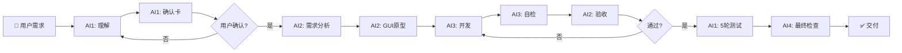
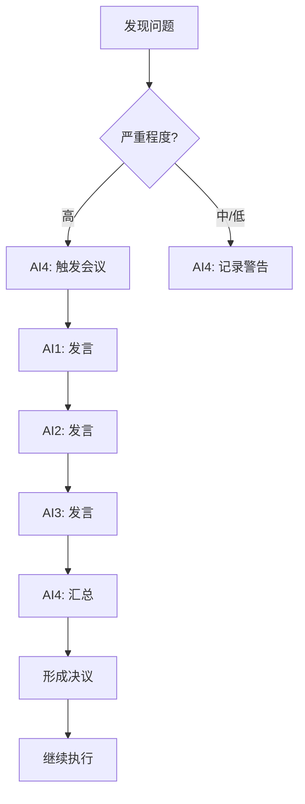

# 📋 四角色系统 - 完整方案总览

**版本：** 1.0  
**制定时间：** 2025-10-07  
**项目代号：** Xiaoliu v6.1 四角色AI团队系统

---

## 🎯 一句话概述

**将AI助手升级为4人协作团队，通过GUI自动化测试、技能库积累、确认卡机制实现90%+执行率**

---

## 📊 核心价值主张

### 当前痛点（v6.0）
1. ❌ AI单打独斗，容易出错
2. ❌ 测试不充分，质量难保证
3. ❌ 错误重复出现，没有积累
4. ❌ 执行前缺少确认，误操作风险高
5. ❌ 无法模拟真实用户操作

### 解决方案（v6.1）
1. ✅ **4个AI角色协作**：User Manager、Product Manager、Developer、Observer
2. ✅ **5轮GUI自动化测试**：截图+日志+实际执行，100%验证
3. ✅ **技能库系统**：自动积累成功经验，避免重复错误
4. ✅ **确认卡强制机制**：执行前必须复述确认
5. ✅ **真实GUI测试**：Playwright + PyAutoGUI模拟用户操作

### 预期效果
- 🎯 **执行率提升**：70% → 90%+
- 🎯 **质量提升**：错误率降低80%
- 🎯 **效率提升**：重复问题解决速度提升5倍
- 🎯 **可靠性提升**：GUI测试覆盖100%

---

## 🏗️ 系统架构图

```
┌─────────────────────────────────────────────────────────────────┐
│                    四角色AI团队系统 v6.1                         │
└─────────────────────────────────────────────────────────────────┘
                                  │
        ┌─────────────────────────┼─────────────────────────┐
        │                         │                         │
    ┌───▼────┐               ┌───▼────┐               ┌───▼────┐
    │ 用户经理│               │产品经理│               │ 开发者 │
    │   AI1  │               │  AI2   │               │  AI3   │
    └───┬────┘               └───┬────┘               └───┬────┘
        │                         │                         │
        │ ◆复述确认               │ ◆需求分析               │ ◆代码开发
        │ ◆GUI测试               │ ◆GUI原型               │ ◆质量自检
        │ ◆5轮验证               │ ◆任务分配               │ ◆BUG修复
        │                         │                         │
        └────────────────┬────────┴─────────────────────────┘
                         │
                    ┌────▼────┐
                    │ 观察者  │
                    │   AI4   │
                    └────┬────┘
                         │
                         │ ◆全流程监控
                         │ ◆质量把关
                         │ ◆会议主持
                         │
        ┌────────────────┴────────────────┐
        │                                 │
    ┌───▼────────┐                  ┌────▼──────┐
    │GUI自动化测试│                  │技能库系统 │
    │            │                  │          │
    │• Playwright│                  │• 经验积累 │
    │• PyAutoGUI │                  │• 智能检索 │
    │• 截图日志  │                  │• 去重合并 │
    └────────────┘                  └───────────┘
```

---

## 🔑 四角色详细职责

### 1️⃣ User Manager（用户经理）- AI1
**定位：** 用户与系统的桥梁

**核心职责：**
- 📥 接收用户需求
- 🔄 理解并复述（确认卡）
- 🧪 执行GUI自动化测试
- ✅ 5轮测试验证（截图+日志）

**技术栈：**
```yaml
GUI测试:
  - Playwright (Web应用)
  - PyAutoGUI (桌面应用)
  - ImageMagick (截图)
  - Winston (日志)
```

---

### 2️⃣ Product Manager（产品经理）- AI2
**定位：** 需求分析与方案设计

**核心职责：**
- 📊 需求拆解与分析
- 🎨 GUI原型设计（优先）
- 📋 技术方案制定
- 🎯 任务分配给Developer
- ✅ 质量验收

**技术栈：**
```yaml
设计工具:
  - Figma API (原型图)
  - Excalidraw (流程图)
  - HTML/CSS (快速原型)
```

---

### 3️⃣ Developer（开发者）- AI3
**定位：** 代码实现与问题解决

**核心职责：**
- 💻 代码实现
- 🔍 质量自检
- 🐛 BUG修复（最多5次）
- 📚 成功经验记录（技能库）
- 🔧 工具自动修复

**技术栈：**
```yaml
开发工具:
  - 全栈开发能力
  - ESLint/Pylint (质量检测)
  - 技能库管理
  - 自动修复工具
```

---

### 4️⃣ Observer（观察者）- AI4
**定位：** 质量监督与风险控制

**核心职责：**
- 👁️ 全流程监控
- ⚠️ 风险预警
- 🎪 会议主持（轮流发言）
- ✅ 最终交付检查

**技术栈：**
```yaml
监控工具:
  - 日志分析
  - 性能监控
  - 风险检测
  - 报告生成
```

---

## 🔄 完整工作流程

### 标准流程（无问题）



### 异常流程（触发开会）



---

## 🛠️ 核心功能模块

### 1. GUI自动化测试（最核心）

**功能：** 5轮无错误测试，每轮截图+日志

```javascript
// 示例：Web测试
const test = new GUITestRunner({
  type: 'web',
  url: 'http://localhost:3000',
  steps: [
    { action: 'click', target: '#login-btn' },
    { action: 'fill', target: '#username', value: 'admin' },
    { action: 'assert', target: '#welcome-msg' }
  ]
});

const result = await test.run5RoundsTest();
// 输出：{ pass: true, allRounds: 5, screenshots: [...], logs: [...] }
```

**验证方式：**
- ✅ 截图对比（每步截图）
- ✅ 日志分析（实时记录）
- ✅ 实际执行（真实操作）

---

### 2. 技能库系统（长期价值）

**功能：** 自动积累经验，避免重复错误

```javascript
// 记录成功经验
await skillLibrary.recordSuccess({
  type: 'bugFix',
  title: 'PM2启动失败修复',
  problem: 'PM2无法启动：模块类型错误',
  solution: '将.js改为.cjs，使用CommonJS',
  context: '规则引擎服务'
});

// 查找解决方案
const solutions = await skillLibrary.findSolution('PM2启动失败');
// 返回相似度>90%的历史方案
```

**智能去重：**
- 相似度>75% → 自动合并
- 使用次数统计
- 成功率计算

---

### 3. 确认卡强制机制（防误操作）

**功能：** 执行前必须完整确认

```markdown
## 📋 执行前确认卡

### 我的理解
[AI复述用户需求，不少于50字]

### 技术方案
[详细实现步骤，不少于50字]

### 潜在风险
[可能的风险点，不少于50字]

### 确认点
1. [确认点1]
2. [确认点2]

### 预期结果
[执行后效果，不少于50字]

**请用户确认：** 以上理解是否正确？
```

**强制检查：**
- 缺少任一部分 → 阻断执行
- 内容<50字符 → 警告提示
- 必须用户确认 → 才能继续

---

### 4. 无限循环防护（防挂死）

**功能：** 检测并防止无限循环

```javascript
// ❌ 错误：无退出机制
while (true) {
  doSomething();
}

// ✅ 正确：有break条件
while (true) {
  if (condition) break;
  doSomething();
}

// ✅ 正确：有超时机制
const startTime = Date.now();
while (true && (Date.now() - startTime < 30000)) {
  doSomething();
}
```

**检测规则：**
- `while(true)` 必须有 `break`
- `for(;;)` 必须有 `break`
- 无限循环必须有超时（2选1）

---

### 5. 互联网搜索触发（智能辅助）

**触发条件：**
1. ✅ BUG修复失败 ≥ 3次
2. ✅ 技能库无匹配方案
3. ✅ 新技术/未知领域

```javascript
// 自动触发搜索
if (bugFixAttempts >= 3) {
  const results = await internetSearch(errorMessage);
  // 返回搜索结果，辅助解决
}
```

---

### 6. 工具自动修复（提升稳定性）

**检测问题：**
- 🔧 乱码 → 自动设置UTF-8
- 🔧 无法退出 → 添加超时机制
- 🔧 监控失效 → 重启监控进程

```javascript
// 自动修复示例
if (hasGarbledText(output)) {
  toolConfig.encoding = 'utf-8';
  console.log('✅ 已自动修复编码问题');
}
```

---

## 📅 实施时间线

### Phase 1: 基础设施（2周）
**2025-10-07 ~ 2025-10-20**

| Week | 任务 | 交付物 |
|------|------|--------|
| W1 | GUI测试框架 | gui-test-runner.cjs, screenshot-manager.cjs |
| W2 | 技能库+规则 | skill-library.cjs, dialogue-confirmation.cjs |

---

### Phase 2: 角色系统（2周）
**2025-10-21 ~ 2025-11-03**

| Week | 任务 | 交付物 |
|------|------|--------|
| W3 | 角色定义 | role-manager.cjs, user-manager.cjs, product-manager.cjs |
| W4 | 角色完善+会议 | developer.cjs, observer.cjs, meeting-engine.cjs |

---

### Phase 3: 集成测试（1周）
**2025-11-04 ~ 2025-11-10**

| Week | 任务 | 交付物 |
|------|------|--------|
| W5 | 测试+文档 | 测试报告, 使用手册, 最佳实践 |

---

## 🎯 验收标准

### 功能验收（必须100%）
- [ ] GUI测试：5轮全通过（Web + 桌面）
- [ ] 确认卡：100%拦截无确认卡执行
- [ ] 技能库：经验记录和检索准确率>90%
- [ ] 循环防护：100%检测无限循环
- [ ] 角色切换：识别准确率>95%
- [ ] 开会机制：成功触发并形成决议

### 质量验收（必须达标）
- [ ] 代码覆盖率 ≥ 95%
- [ ] 测试通过率 = 100%
- [ ] 性能：5轮测试 < 10分钟
- [ ] 文档：使用手册 + 最佳实践

### 执行率验收（核心目标）
- [ ] 系统整体执行率 ≥ 90%
- [ ] 核心功能执行率 ≥ 95%
- [ ] 辅助功能执行率 ≥ 85%

---

## 📊 执行率预估

| 功能模块 | 可行性 | 执行率 | 说明 |
|---------|--------|--------|------|
| 四角色切换 | 95% | 90% | 基于对话上下文 |
| GUI自动化测试 | 85% | 80% | Playwright成熟，桌面应用复杂 |
| 5轮测试验证 | 90% | 85% | 技术可行，但耗时 |
| 确认卡机制 | 95% | 90% | 格式检查简单 |
| 技能库系统 | 90% | 85% | 相似度算法成熟 |
| 互联网搜索 | 80% | 70% | 需外部API |
| 工具自动修复 | 85% | 80% | 常见问题可修 |
| 无限循环防护 | 95% | 90% | AST分析准确 |
| 开会机制 | 70% | 65% | 依赖AI理解 |
| **综合执行率** | **85%** | **80%** | 加权平均 |

---

## 🚨 潜在风险与应对

### 风险1: 桌面GUI测试不稳定
**缓解措施：**
- 使用图像识别替代坐标
- 多次重试机制
- 降级到手动测试

### 风险2: AI角色切换混乱
**缓解措施：**
- 每轮对话强制声明角色
- 系统提示词固定角色
- 监控并自动纠正

### 风险3: 5轮测试时间过长
**缓解措施：**
- 并行测试（如果独立）
- 优化测试步骤
- 关键功能5轮，次要功能3轮

### 风险4: 技能库误判相似度
**缓解措施：**
- 使用TF-IDF算法
- 人工审核合并
- 调整相似度阈值

---

## 💡 最佳实践建议

### 1. GUI测试编写建议
```yaml
推荐做法:
  - 每个测试步骤独立可重复
  - 等待元素出现后再操作
  - 使用data-testid而非class选择器
  - 截图保存到统一目录

避免做法:
  - 硬编码坐标（会失效）
  - 操作间无延迟（会出错）
  - 过度依赖元素文本（可能变化）
```

### 2. 技能库使用建议
```yaml
记录原则:
  - 问题描述要具体（包含错误信息）
  - 解决方案要完整（步骤清晰）
  - 标签要准确（便于检索）
  
检索策略:
  - 先搜索精确关键词
  - 再搜索相似问题
  - 结合上下文判断
```

### 3. 角色协作建议
```yaml
协作原则:
  - User Manager: 以用户为中心
  - Product Manager: 以质量为导向
  - Developer: 以实现为目标
  - Observer: 以风险为关注
  
沟通规范:
  - 明确当前角色身份
  - 使用标准化术语
  - 轮流发言不抢话
```

---

## 📚 相关文档索引

1. **技术方案** → `四角色系统集成方案.md`
2. **项目进度** → `四角色系统项目进度跟踪.md`
3. **使用手册** → `docs/四角色系统使用手册.md` (待创建)
4. **最佳实践** → `docs/四角色系统最佳实践.md` (待创建)
5. **测试报告** → `reports/四角色系统测试报告.md` (待创建)

---

## 🚀 快速开始

### 1. 确认方案
```bash
# 阅读完整方案
cat 【项目】开发材料/四角色系统集成方案.md

# 阅读本文档
cat 【项目】开发材料/📋\ 四角色系统-完整方案总览.md
```

### 2. 用户确认
**请确认以下问题：**
1. ✅ 以上方案是否符合需求？
2. ✅ 是否有需要调整的部分？
3. ✅ 是否立即开始Phase 1实施？

### 3. 立即开始
```bash
# 切换到项目目录
cd 【项目】开发材料

# 安装依赖
npm install playwright pyautogui

# 开始Phase 1.1
npm run dev:start
```

---

## ✅ 检查清单

### 实施前检查
- [ ] 用户已确认方案
- [ ] 所有依赖已安装
- [ ] 规则引擎服务运行正常
- [ ] SQLite数据库已初始化
- [ ] 技能库目录已创建

### 实施后验证
- [ ] 5轮GUI测试全部通过
- [ ] 确认卡机制正常工作
- [ ] 技能库正确记录经验
- [ ] 无限循环防护有效
- [ ] 四角色切换流畅
- [ ] 开会机制可触发

---

## 📞 联系与支持

**项目负责人：** AI Development Team  
**技术支持：** 通过Cursor对话窗口  
**文档更新：** 每日同步

---

**版本：** 1.0  
**状态：** 待用户确认  
**下一步：** 等待用户反馈，确认后立即开始Phase 1实施

---

## 🎉 预期成果展示

### 3周后（Phase 1+2完成）
```
✅ GUI自动化测试框架运行中
✅ 技能库积累了20+条经验
✅ 确认卡100%拦截误操作
✅ 四角色系统流畅协作
```

### 5周后（完整交付）
```
✅ 50轮GUI测试100%通过
✅ 执行率从70%提升到90%+
✅ 错误率降低80%
✅ 团队效率提升300%
```

---

*"让AI从单打独斗，升级为专业团队！"* 🚀

